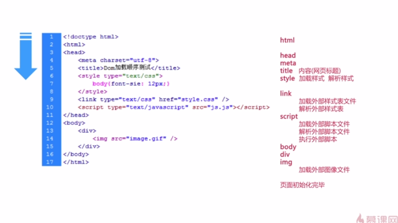
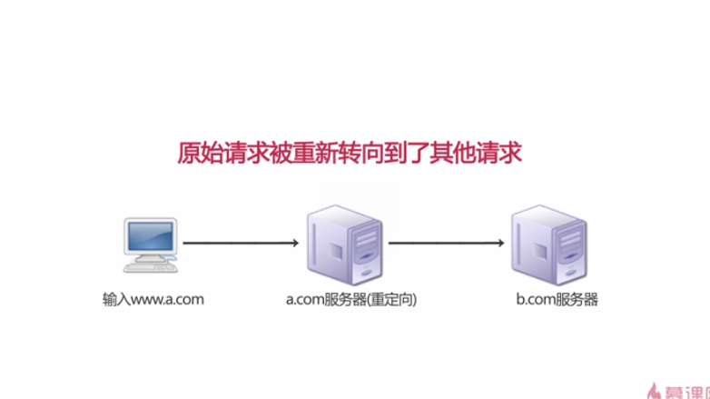

##YAHOO军规

###1 尽可能减少HTTP请求：
从客户端到服务器端的请求方法，包括消息首行中，对资源的请求方法资源的标示符及使用的协议

###2 使用CDN（内容分发网络）：
意思是尽可能避开互联网上有可能营销数据传输速度和稳定性的瓶颈和缓解，使内容的传输更快更稳定。

###3 添加Expire/Cache-Control头：
如果Apache开启了expire模块，当浏览器发送资源请求的时候，Apache返回资源的同时，会返回一个expire的http头，expire头的北荣是一个时间值，值就是资源在本地的国企事件，存在本地在本地缓存阶段找到一个对应的资源值，当前时间还没超过资源的过期 事件，就直接使用这一个资源，不会发送http请求。

###4 启用Gzip压缩：
将文件先在服务器端压缩，然后再传输到浏览器，浏传输完毕后，浏览器再进行解压缩

###5 将CSS放在页面最上面：
避免空白和闪烁
###6 将script放在页面最下面,：
防止阻塞

###7 避免在css中使用Expressions

在压面显示和缩放，页面滚动或者移动鼠标的时候都会重新计算，严重影像浏览器性能

###8 将javascript和css都放在外面使得文件当中

以下情况在页面内书写script和css：
    * 只应用于一个页面内
    * 不经常被访问到
    * 脚本和样式很少
###9 减少DNS查询

默认情况下IE的缓存是件为30Min，FireFox为60S，Chorme为60S。
当缓存时间长时：减少DNS的重复查找，节省时间。
当缓存时间短时：即使检测网站服务器的变化，保证正确性。

###10 最小化JavaScript和CSS
1，去除不必要的空白符、格式符、注释符
2，简写方法名，参数名压缩Js脚本
###11 避免重定向：
原始请求被重新转向到了其他请求 

为什么要避免重定向：

###12 移除重复的脚本
###13 配置实体标签（ETag）
- Entity Tag（实体标签）
- 属于HTTP协议
- 收Web服务支持
使用特殊字符串来表示某个请求资源版本：一种标示，一颗资源，一个版本，独一无二

###14 使用Ajax缓存
全称：Asynchronous JavaScript and XML 异步的JavaScript和XML
分批加载，局部更新

##搜索引擎工作原理
百度蜘蛛

###扁平化结构

- 控制首页链接数量
	首页链接不能太多也不能太少，建议在100个以内的链接
- 扁平化的目录层次
	尽量点击3次链接就能让用户到达任意内容
- 导航SEO优化
	面包屑导航，让用户了解当前所处位置，使用户可以了解网站组织形式

- 不可忽略的细节
	* 首页-上页-下页-尾页
	* 首页 1 2 3 4 5 6 7 8 9 10 下一页
	* 首页 1 2 3 4 5 6 7 8 9 10 下拉列表
	蜘蛛程序最喜欢第三种结构

###代码优化

- `<title>`
- `<meta description>`
- `<meta keywords>`
- 语义化代码
	* H1~H6标签多用于标题
	* UL标签多用于无序列表
	* oL标签多用于有序列表
	* DL标签多用于定义数据列表
	* em,strong表示强调
- `<a>`标签
	加上链接的说明title属性
	指向其他网站的链接加上rel="nofollow"；
- `<h1>`标签
	正文标题h1
- `
`标签与` `标签
	` `标签只适用于p文本段落的换行 可以用p标签包裹br标签
- `<table>` 标签
	表格标签caption标签的使用
- ``标签
	应该用alt说明
- `<strong><em>`强调文字内容
- `<b><i>`标签仅仅为了加粗斜体
- 利用css将重要内容HTML代码放在最前面
- 重要内容不要用JS输出
- 尽量少使用iframe框架
- 隐藏文字使用display:none会被蜘蛛程序忽略
- 尽量精简代码
