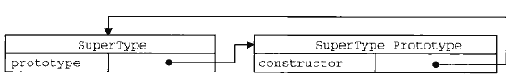
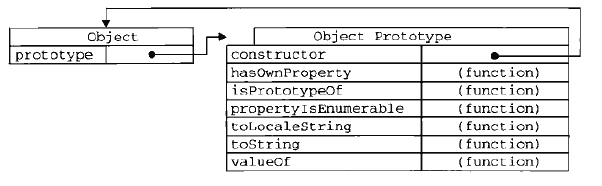
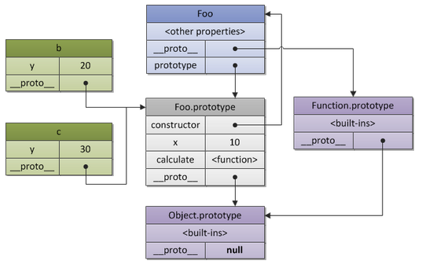

###首先，那么什么是原型呢

在一个对象被建立时，就会生成一个默认属性prototype，也就是原型属性，prototype属性是也一个对象，其他对象可以通过它实现属性和方法的继承。

刚刚我说在一个对象被建立时，就会生成一个默认属性，那么意思是所有对象都有原型？

看看下面这句代码：


console.log(({}).prototype); // null


难道刚刚说的不对？确实有一个例外情况，那就是原型链的最后，`Object`对象的原型为null，除此之外的对象都是有原型的。

###顺道说一下对象

那么对象又是个什么玩意呢，这东西很抽象啊好像，而且我们经常说js的一切皆对象。好像对象很牛逼的样子啊，不错，javascript中确实一切皆对象，除了基本值类型。

下面我们来看看javascript中各种函数啊，数组啊，Date()啊，Number啊，基本值类型啊到底是都是什么类型，用到一个基本的函数--typeof(),大家应该都很熟悉吧

来看下面这段代码


function show(x) {

   console.log(typeof(x));    // undefined
   console.log(typeof(10));   // number
   console.log(typeof('abc')); // string
   console.log(typeof(true));  // boolean

   console.log(typeof(function () { }));  //function

   console.log(typeof([1, 'a', true]));  //object
   console.log(typeof ({ a: 10, b: 20 }));  //object
   console.log(typeof (null));  //object
   console.log(typeof (new Number(10)));  //object
}
show();


除了undefined, number, string, boolean之外，剩下的几种情况——函数、数组、对象、null、new Number(10)都是对象。他们都是引用类型。咦，那那个function呢，明明没有显示function啊，这个时候用到另一个函数--instanceOf

我们再看看结果：


var fn = function () { };
console.log(fn instanceof Object);  // true


好了，说了半天对象，搞得我都想找对象了，毕竟对象这么牛啊你说对么~哈哈哈

好了言归正传，给对象下一个通俗定义--对象，就是若干属性的集合。

###prototype属性

前面的出的结论，函数也是一个对象，当然这在函数自身也是有迹可循的，比如创建一个函数SuperType之后，函数默认就有了一个prototype属性(当然也是一个对象！)。

左侧是一个SuperType函数，右侧是他的原型prototype属性，prototype属性默认只有一个constructor属性，指向创造它的构造函数。前面说到原型这么厉害，怎么只有一个constructor属性？当然这里只是举个栗子~下面看看这位Object大哥~

Object对象的原型方法就多了，而且这些好像我们都经常使用哦有木有？

下面来看个例子：


function Fn() { }
	Fn.prototype.name = '漏鸣杰';
	Fn.prototype.getYear = function () {
		return 1992;
};

var f = new Fn();
console.log(f.name);// '漏鸣杰'
console.log(f.getYear());// 1992


函数Fn的原型属性(prototype property )是一个对象，当这个函数被用作构造函数来创建实例时，该函数的原型属性将被作为原型赋值给所有对象实例(注:即所有实例的原型引用的是函数的原型属性)，即Fn是一个构造函数，f是Fn函数new出来的，这样f对象就可以调用Fn.prorotype属性了，为什么呢，因为有一个默认的隐式原型--__proto__。

###隐式原型__proto__

通过上面那个例子，我们发现，构造函数和实例之间会有一种隐藏的联系，实例可以使用构造函数的原型属性，这就是通过隐式原型联系在一起的。对象的__proto__指向创建该对象的函数的prototype属性。ECMA引入了标准对象原型访问器Object.getPrototype(object)，到目前为止只有Firefox和chrome实现了此访问器。除了IE，其他的浏览器支持非标准的访问器__proto__，如果这两者都不起作用的，我们需要从对象的构造函数中找到的它原型属性。下面的代码展示了获取对象隐式原型的方法


var a = {}; 

//Firefox 3.6 and Chrome 5 
Object.getPrototypeOf(a); //[object Object]   
 
//Firefox 3.6, Chrome 5 and Safari 4  
a.__proto__; //[object Object]   
 
//all browsers 
a.constructor.prototype; //[object Object]


###constructor

上面提到的constructor我说是指向产生该对象的构造函数，可能有点难以理解，这里通过一个例子，应该会好理解很多，请看代码：


// 构造函数
function Foo(y) {
  // 构造函数将会以特定模式创建对象：被创建的对象都会有"y"属性
  this.y = y;
}
 
// "Foo.prototype"存放了新建对象的原型引用
// 所以我们可以将之用于定义继承和共享属性或方法
// 所以，和上例一样，我们有了如下代码：
 
// 继承属性"x"
Foo.prototype.x = 10;
 
// 继承方法"calculate"
Foo.prototype.calculate = function (z) {
  return this.x + this.y + z;
};
 
// 使用foo模式创建 "b" and "c"
var b = new Foo(20);
var c = new Foo(30);
 
// 调用继承的方法
b.calculate(30); // 60
c.calculate(40); // 80
 
// 让我们看看是否使用了预期的属性
 
console.log(
 
  b.__proto__ === Foo.prototype, // true
  c.__proto__ === Foo.prototype, // true
 
  // "Foo.prototype"自动创建了一个特殊的属性"constructor"
  // 指向a的构造函数本身
  // 实例"b"和"c"可以通过授权找到它并用以检测自己的构造函数
 
  b.constructor === Foo, // true
  c.constructor === Foo, // true
  Foo.prototype.constructor === Foo // true
 
  b.calculate === b.__proto__.calculate, // true
  b.__proto__.calculate === Foo.prototype.calculate // true
 
);


上述代码可表示为如下的关系：

上述图示可以看出，每一个object都有一个prototype. 构造函数Foo也拥有自己的__proto__, 也就是Function.prototype, 而Function.prototype的__proto__指向了Object.prototype. 重申一遍，Foo.prototype只是一个显式的属性，也就是b和c的__proto__属性。而最后的Object。prototype对象的隐式原型指向null，就如同前面所说每一个对象都有原型，除了Object，是不是很直观？

###原型链

从上面那张图我们看到从b->Foo.prototype->Object.prototype有一条链接。从c->Foo.prototype->Object.prototype又是一条链接。还有从Foo->Function.prototype->Object.prototype。没错这就是我们所说的原型链，每个对象和对象的原型属性都有一个隐式原型。实例的隐式原型指向构造函数的原型属性，也就是b和c指向Foo.prototype，构造函数指向上一级构造函数的原型属性，最终指向Object.prototype也就是Foo指向Function.prototype再指向Object.prototype，构造函数的原型属性指向上一级构造函数的prototype，若上一级为Function，则指向Object.prototype.